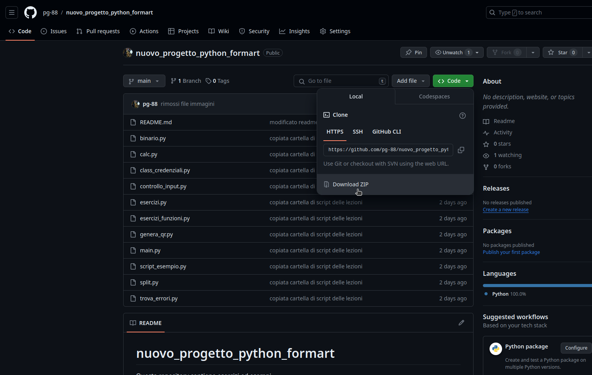

# Laboratorio Python
Questa repository contiene esercizi ed esempi utili per fare pratica con la programmazione in python

### Come usare questa repository

Questa repository è sincronizzata con la cartella condivisa su drive legata alla mia parte di corso. Per utilizzare i file, quinidi potete recuperarli direttamente da drive, oppure da gitHub cliccando sul bottone verde e selezionando l'ultima opzione "Download Zip".

I più temerari di voi possono anche provare a fare un fork della repository.

Troverete varie cartelle:
- [esercizi](esercizi): qui metto gli script con gli esercizi proposti. Alcuni file, oltre al testo dell'esercizio contengono il test per verificare se l'esercizio è stato fatto correttamente. Quinidi sono da modificare e poi lanciare per sapere subito se l'esercizio risolto.
  - [soluzioni](esercizi/soluzioni_proposte) per alcuni esercizi ci può essere una soluzione fatta da me, se la vostra è diversa non è un problema, basta che funzioni!
- [esempi modelli](esempi_modelli) In questa cartella trovate script utili che potete già utilizzare o tenere come modello. Sono cose che probabilmente non riusciremo a vedere a lezione ma con un po' di sforzo dovreste riuscire a capire da soli come funzionano e spero vi serviranno come spunto per il futuro.
- [risorse](risorse) contiene semplicemente file utili per i readme o per il codice di alcuni script

Alcuni link utili:
- [freeCodeCamp](https://www.freecodecamp.org/)
- [CodeWars](https://www.codewars.com/)
- [MarkDown](https://www.markdownguide.org/basic-syntax/) I readme di solito sono scritti con questa sintassi. Potete pensare al markdown come a un html semplificato

Happy Hacking! :grinning:
